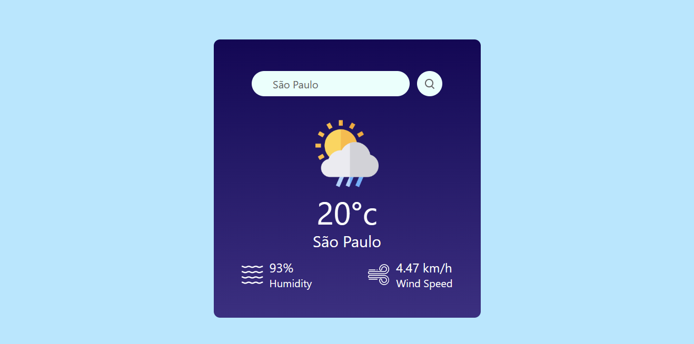

<h1 align="center">Simple Weather App</h1>

<p align="center">
  
</p>

<p align="center">Acesse informações climáticas em segundos!</p>

## Visão Geral
O Simple Weather App é uma aplicação web que permite aos usuários obter informações climáticas de qualquer cidade do mundo. Basta inserir o nome da cidade no campo de pesquisa, pressionar Enter e você receberá os dados climáticos em tempo real da API do OpenWeather.

## Tecnologias
Este projeto foi desenvolvido utilizando as seguintes tecnologias:

- ReactJS
- TypeScript
- TailwindCSS
- API do OpenWeather
- Vite

## Funcionalidades
- Pesquise informações climáticas de qualquer cidade.
- Receba dados atualizados, incluindo temperatura, umidade, velocidade do vento e muito mais.
- Interface de usuário simples e amigável.

<!-- ## Informações Úteis
- Projeto no ar [aqui](https://gafanhotoalexandre.github.io/frontend-quiz/) -->

## Executando o Projeto
Certifique-se de que você tenha o Node.js instalado em seu sistema.

### Pré-requisitos

Certifique-se de que você tenha o Node.js instalado em seu sistema.

### Instalação
Clone o repositório e instale as dependências:

```bash
git clone https://github.com/gafanhotoalexandre/frontend-quiz.git
cd frontend-quiz
npm install
npm run dev
```